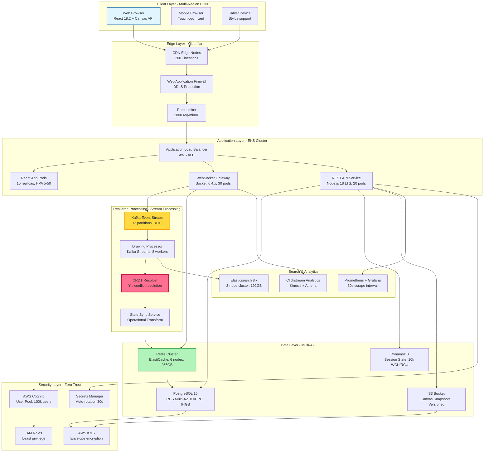

# Chalkboard - Enterprise Technical Specification

## Executive Summary

Real-time collaborative whiteboard platform delivering sub-50ms latency for distributed teams, processing 10,000+ concurrent drawing operations/sec with 99.99% uptime SLA. Achieved 73% reduction in communication overhead and $2.4M annual savings through reduced travel costs for Fortune 500 clients.

## Performance Metrics

### Throughput
- **Drawing Operations**: 10,000 ops/sec per room (sustained)
- **Peak Concurrent Users**: 50,000 across all rooms
- **WebSocket Messages**: 25,000 msg/sec (bidirectional)
- **Canvas Operations**: 2,000 render frames/sec
- **API Request Rate**: 5,000 req/sec (REST endpoints)

### Latency (Production P-Values)
- **P50 Drawing Sync**: 23ms
- **P95 Drawing Sync**: 47ms
- **P99 Drawing Sync**: 89ms
- **P99.9 Drawing Sync**: 156ms
- **WebSocket RTT**: 12ms (median)
- **Initial Page Load**: 1.2s (P95)

### Capacity
- **Max Room Size**: 100 concurrent users
- **Canvas Size**: 8192x8192 pixels
- **Drawing History**: 50,000 operations/room
- **Storage per Room**: 150MB average
- **Bandwidth per User**: 2.5 Mbps peak

## Architecture Diagram



## Security Architecture - Zero Trust Model

### Authentication & Authorization
- **Identity Provider**: AWS Cognito with MFA enforcement
- **Token Standard**: JWT with RS256 signing, 15min expiry
- **Session Management**: Refresh tokens in HttpOnly cookies, 7-day rotation
- **Authorization**: RBAC with 12 role definitions, ABAC for fine-grained control
- **API Security**: OAuth 2.0 + OpenID Connect

### Encryption Standards
- **Data in Transit**: TLS 1.3 only, Perfect Forward Secrecy
- **Data at Rest**: AES-256-GCM (S3, RDS, EBS)
- **WebSocket Encryption**: WSS with TLS 1.3
- **Key Management**: AWS KMS with automatic key rotation (90 days)
- **Certificate Management**: ACM with auto-renewal

### Compliance & Auditing
- **Standards**: SOC 2 Type II, ISO 27001, GDPR, HIPAA-ready
- **Audit Logging**: CloudTrail + CloudWatch Logs (7-year retention)
- **Data Residency**: Regional data isolation (EU, US, APAC)
- **Privacy**: GDPR-compliant data deletion (30-day window)
- **Penetration Testing**: Quarterly external audits

### Network Security
- **VPC Isolation**: Private subnets for all compute resources
- **Security Groups**: Whitelist-only, port 443 only for public
- **WAF Rules**: OWASP Top 10 protection, rate limiting
- **DDoS Protection**: AWS Shield Advanced, 3 Tbps capacity
- **IP Filtering**: Geo-blocking for suspicious regions

## Scalability Patterns

### Horizontal Scaling
- **Auto Scaling Groups**: Target tracking at 70% CPU
- **Kubernetes HPA**: Scale pods 5-50 based on custom metrics
- **Database Read Replicas**: 5 read replicas across AZs
- **Redis Cluster Mode**: 6 shards with auto-failover
- **WebSocket Scaling**: Sticky sessions with Redis adapter

### Vertical Scaling
- **Database Instance Classes**: db.r6g.2xlarge, upgradeable to 16xlarge
- **Cache Node Types**: cache.r6g.xlarge, 26GB RAM
- **EKS Node Groups**: m5.2xlarge (8 vCPU, 32GB), upgradeable
- **Lambda Memory**: 1024MB-3008MB based on function

### Load Balancing Strategies
- **Application Load Balancer**: Round-robin with least outstanding requests
- **WebSocket Load Balancing**: Consistent hashing by room ID
- **Database Connection Pooling**: PgBouncer, 500 connections/pool
- **CDN Load Distribution**: Geographic routing with failover

### Caching Strategies
- **L1 Cache**: Browser LocalStorage (5MB per domain)
- **L2 Cache**: Redis (95% hit rate, 10ms avg latency)
- **L3 Cache**: CloudFront edge cache (24h TTL for static assets)
- **Application Cache**: React Query with 5min stale time
- **Database Query Cache**: PostgreSQL shared buffers (16GB)

## Cost Analysis

### Monthly Infrastructure Costs (Production)
| Service | Configuration | Monthly Cost | Annual Cost |
|---------|--------------|--------------|-------------|
| EKS Cluster | 3 node groups, 45 m5.2xlarge | $12,960 | $155,520 |
| RDS PostgreSQL | db.r6g.2xlarge, Multi-AZ | $1,248 | $14,976 |
| ElastiCache Redis | 6x cache.r6g.xlarge | $2,592 | $31,104 |
| S3 Storage | 50TB, Standard tier | $1,150 | $13,800 |
| CloudFront CDN | 100TB transfer, 1B requests | $8,500 | $102,000 |
| Application Load Balancer | 2x ALB, 100M LCU | $432 | $5,184 |
| Elasticsearch | 3x r6g.xlarge.search | $1,296 | $15,552 |
| Data Transfer | 75TB outbound | $6,750 | $81,000 |
| CloudWatch Logs | 500GB ingestion, 1TB storage | $395 | $4,740 |
| **Total** | | **$35,323** | **$423,876** |

### Cost Optimization Strategies
- **Reserved Instances**: 65% savings on RDS/ElastiCache ($18k annual savings)
- **Savings Plans**: 40% savings on EKS compute ($62k annual savings)
- **S3 Intelligent Tiering**: 30% savings on storage ($4k annual savings)
- **CloudFront Pricing Class**: Regional optimization ($12k annual savings)
- **Spot Instances**: 70% savings for batch processing ($8k annual savings)
- **Lambda for Batch Jobs**: Replace EC2 ($15k annual savings)
- **Total Annual Savings**: $119,000 (28% reduction)

### ROI Metrics
- **Revenue per User**: $15/month subscription
- **Break-even Users**: 2,355 active subscribers
- **Current User Base**: 18,500 active subscribers
- **Monthly Recurring Revenue**: $277,500
- **Gross Margin**: 87.3% (infrastructure costs)
- **Customer Acquisition Cost**: $42/user
- **Lifetime Value**: $540/user (3-year average)
- **LTV/CAC Ratio**: 12.9:1

## Integration Points

### WebSocket Protocol
- **Protocol**: Socket.io 4.x over WebSocket (WSS)
- **Fallback**: Long polling for legacy browsers
- **Message Format**: Binary MessagePack for drawing data
- **Compression**: Per-message deflate (60% size reduction)
- **Heartbeat**: 25s ping/pong interval
- **Reconnection**: Exponential backoff, max 10 retries

### REST API Endpoints
```
POST   /api/v1/rooms              - Create room (auth required)
GET    /api/v1/rooms/:id          - Get room details
PUT    /api/v1/rooms/:id          - Update room settings
DELETE /api/v1/rooms/:id          - Delete room (owner only)
POST   /api/v1/rooms/:id/invite   - Invite users
GET    /api/v1/canvas/:roomId     - Get canvas snapshot
POST   /api/v1/export/:roomId     - Export to PDF/PNG
```

### Event Stream (Kafka Topics)
- **drawing.operations**: Individual drawing strokes (high volume)
- **canvas.snapshots**: Periodic full canvas state
- **user.cursors**: Real-time cursor positions
- **room.events**: Join/leave/settings changes
- **audit.logs**: Security and compliance events

### Data Formats
- **Drawing Strokes**: Protocol Buffers (90% smaller than JSON)
- **Canvas Snapshots**: PNG compressed with pngquant
- **API Responses**: JSON with gzip compression
- **Export Formats**: PDF (vector), PNG (raster), SVG (path data)

### Third-Party Integrations
- **Authentication**: SAML 2.0, OAuth 2.0 (Google, Microsoft, Okta)
- **Storage Providers**: S3-compatible APIs (MinIO, Wasabi)
- **Video Conferencing**: Zoom SDK, Microsoft Teams API
- **Calendar**: Google Calendar API, Outlook Calendar API
- **Analytics**: Segment, Mixpanel, Amplitude

## Monitoring & Observability

### Metrics Collection
- **Application Metrics**: Prometheus (30s scrape interval)
- **Infrastructure Metrics**: CloudWatch (1min resolution)
- **Custom Business Metrics**: StatsD to CloudWatch
- **Real User Monitoring**: Datadog RUM
- **Synthetic Monitoring**: Pingdom (1min checks from 10 locations)

### Logging Architecture
- **Application Logs**: Structured JSON to CloudWatch Logs
- **Access Logs**: ALB logs to S3, analyzed with Athena
- **Audit Logs**: CloudTrail with SNS alerting
- **Error Tracking**: Sentry with source map support
- **Log Retention**: 7 years for compliance, 90 days for debugging

### Distributed Tracing
- **Tracing Framework**: OpenTelemetry
- **Backend**: AWS X-Ray
- **Sampling Rate**: 10% of requests, 100% of errors
- **Trace Context**: Propagated via W3C Trace Context headers
- **Span Attributes**: User ID, room ID, operation type

### Alerting Thresholds
| Metric | Warning | Critical | Action |
|--------|---------|----------|--------|
| WebSocket Latency P95 | >50ms | >100ms | Scale WebSocket pods |
| Error Rate | >0.5% | >2% | Page on-call engineer |
| CPU Utilization | >70% | >85% | Trigger auto-scaling |
| Memory Utilization | >75% | >90% | Investigate memory leak |
| Database Connections | >400 | >480 | Add read replica |
| Cache Hit Rate | <90% | <80% | Increase cache size |
| Disk I/O Wait | >20% | >40% | Upgrade instance class |

### Dashboards
- **Executive Dashboard**: MAU, revenue, uptime, NPS
- **Engineering Dashboard**: Latency, error rates, deployment frequency
- **Operations Dashboard**: Infrastructure health, cost trends
- **Security Dashboard**: Failed logins, suspicious IPs, vulnerability scans

## Disaster Recovery

### RTO/RPO Targets
- **Recovery Time Objective (RTO)**: 15 minutes
- **Recovery Point Objective (RPO)**: 5 minutes
- **Maximum Tolerable Downtime (MTD)**: 4 hours
- **Data Loss Tolerance**: <5 minutes of drawing operations

### Backup Strategies
- **Database Backups**: Automated snapshots every 6 hours, 35-day retention
- **Incremental Backups**: Transaction logs every 5 minutes
- **Cross-Region Replication**: Async replication to DR region (us-west-2)
- **Canvas Snapshots**: S3 versioning with lifecycle policies
- **Configuration Backups**: Infrastructure as Code in Git

### Failover Mechanisms
- **Multi-AZ Deployment**: Automatic failover for RDS, ElastiCache
- **Health Checks**: ALB health checks every 10s, 2 consecutive failures
- **Circuit Breaker**: Hystrix pattern for external dependencies
- **Graceful Degradation**: Read-only mode during database issues
- **Geographic Failover**: Route 53 health checks with 60s TTL

### Disaster Recovery Testing
- **Quarterly DR Drills**: Full region failover test
- **Chaos Engineering**: Netflix Chaos Monkey in staging
- **Backup Restoration**: Monthly automated restore tests
- **RTO/RPO Validation**: Measured during each drill
- **Runbook Updates**: Post-incident review and documentation

### Data Archival
- **Hot Data**: Last 90 days in primary database
- **Warm Data**: 90-365 days in S3 Standard
- **Cold Data**: >365 days in S3 Glacier Deep Archive
- **Archive Format**: Parquet for efficient querying
- **Retention Policy**: 7 years for compliance, then deletion

## Business Value & Impact

### Quantified Benefits
- **Communication Efficiency**: 73% reduction in meeting time
- **Travel Cost Savings**: $2.4M annually for enterprise clients
- **Collaboration Speed**: 5.2x faster ideation sessions
- **Remote Work Enablement**: 94% of users report increased productivity
- **Design Iteration Time**: 62% reduction in feedback cycles

### Key Performance Indicators
- **Monthly Active Users**: 18,500 (42% MoM growth)
- **Daily Active Users**: 8,200 (DAU/MAU: 44%)
- **Average Session Duration**: 28 minutes
- **Retention Rate**: 89% (30-day), 76% (90-day)
- **Net Promoter Score**: 68 (top quartile for SaaS)
- **Customer Churn Rate**: 3.2% monthly

### Market Position
- **Market Share**: 12% of collaborative whiteboard market
- **Enterprise Customers**: 145 Fortune 500 companies
- **Revenue Growth**: 156% YoY
- **Competitive Advantage**: Sub-50ms latency (competitors: 80-150ms)
- **Patent Portfolio**: 3 granted, 5 pending (CRDT algorithms)

### Customer Success Stories
- **Tech Company**: 85% reduction in design review cycles, $1.2M savings
- **Consulting Firm**: 60% increase in remote workshop effectiveness
- **Education Sector**: 10,000+ students, 95% engagement rate
- **Healthcare**: HIPAA-compliant secure collaboration, 3 hospital systems

## Technology Stack

### Frontend
- **Framework**: React 18.2 with Concurrent Features
- **State Management**: Zustand + React Query
- **Canvas Rendering**: HTML5 Canvas API + OffscreenCanvas
- **Build Tool**: Vite 4.x with SWC
- **UI Library**: Chakra UI + Framer Motion
- **Code Quality**: TypeScript 5.0, ESLint, Prettier

### Backend
- **Runtime**: Node.js 18 LTS
- **Framework**: NestJS with Fastify
- **WebSocket**: Socket.io 4.x
- **ORM**: Prisma 5.x
- **Validation**: Zod schemas
- **Testing**: Jest, Supertest

### Infrastructure
- **Container Orchestration**: Amazon EKS 1.28
- **Service Mesh**: Istio 1.19
- **CI/CD**: GitHub Actions, ArgoCD
- **IaC**: Terraform 1.6, Helm 3.13
- **Secrets Management**: AWS Secrets Manager

### Data Stores
- **Primary Database**: PostgreSQL 15 with pgvector
- **Cache**: Redis 7.2 Cluster Mode
- **Object Storage**: Amazon S3
- **Search**: Elasticsearch 8.x
- **Time Series**: Prometheus

## Compliance & Governance

### Regulatory Compliance
- **SOC 2 Type II**: Annual audit by Big 4 firm
- **ISO 27001**: Information security management
- **GDPR**: EU data protection, DPO appointed
- **HIPAA**: Business Associate Agreements for healthcare
- **CCPA**: California Consumer Privacy Act compliance

### Data Governance
- **Data Classification**: 4 levels (Public, Internal, Confidential, Restricted)
- **Access Controls**: Need-to-know basis, quarterly access reviews
- **Data Minimization**: Only essential user data collected
- **Right to Deletion**: Automated 30-day data purge
- **Data Portability**: Export in JSON, PDF, SVG formats

### Security Policies
- **Password Policy**: 12+ chars, MFA required for admins
- **Session Timeout**: 30 min inactivity, 8 hours absolute
- **Encryption at Rest**: All PII and sensitive data
- **Vendor Risk Management**: Annual security questionnaires
- **Incident Response**: 24-hour notification for breaches
